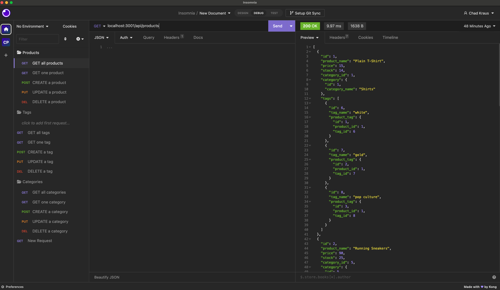

# E-commerceBackEnd
A backend server and API for E-commerce.

## Description

The E-commerce Back-End is a backend application that provides the necessary API endpoints for managing an e-commerce website. It allows users to perform CRUD operations (Create, Read, Update, Delete) on products, categories, and tags. The application is built using Node.js, Express.js, and Sequelize as the ORM (Object-Relational Mapping) tool for interacting with the MySQL database.

[GitHub Repository](https://github.com/chadkraus87/E-commerceBackEnd)

## Table of Contents

- [Installation](#installation)
- [Usage](#usage)
- [License](#license)
- [Contributing](#contributing)
- [Tests](#tests)
- [Questions](#questions)

## Installation

To install and set up the E-commerce Back-End application, follow these steps:

1. Clone this repository to your local machine.
2. Open a terminal and navigate to the project directory.
3. Run the command `npm install` to install the required dependencies.
4. Set up your MySQL database and configure the database connection settings in the `config/connection.js` file.
5. Run the command `npm run seed` to seed the database with sample data (optional).
6. Run the command `npm start` to start the application.

## Usage

Once the E-commerce Back-End application is set up and running, you can use tools like [Insomnia](https://insomnia.rest/) or [Postman](https://www.postman.com/) to interact with the API endpoints.

The available API endpoints are:

- `/api/products` (GET, POST, PUT, DELETE)
- `/api/categories` (GET, POST, PUT, DELETE)
- `/api/tags` (GET, POST, PUT, DELETE)

Refer to the API documentation or code comments for more details on how to use each endpoint.

## License

This project is licensed under the [MIT License](LICENSE).

## Contributing

[Node MySQL 2 Package](https://www.npmjs.com/package/mysql2)

[DotENV Package](https://www.npmjs.com/package/dotenv)

[Async Function](https://developer.mozilla.org/en-US/docs/Web/JavaScript/Reference/Statements/async_function)

[SQL Syntax](https://www.w3schools.com/sql/sql_syntax.asp)

[Getting Started with MySQL](https://dev.mysql.com/doc/mysql-getting-started/en/#mysql-getting-started-installing)

[Try...Catch Statements](https://developer.mozilla.org/en-US/docs/Web/JavaScript/Reference/Statements/try...catch)

[Model Querying - Basics](https://sequelize.org/docs/v6/core-concepts/model-querying-basics/)

[Model Basics](https://sequelize.org/docs/v6/core-concepts/model-basics/)

[Testing Insomnia Endpoints](https://dev.to/kmcknight91/how-to-use-insomnia-to-test-api-endpoints-1lad)

## Tests

N/A

## Questions

If you have any questions or comments about this project, please contact me at chadkraus87@gmail.com. You can also find more information and other projects on my GitHub https://github.com/chadkraus87. If you encounter any issues or bugs while using this tool, please report them to the project GitHub repository so that they can be addressed. Additionally, contributions to this project are always welcome. If you would like to contribute, please review the project contribution guidelines and submit a pull request. Thank you for your support!
